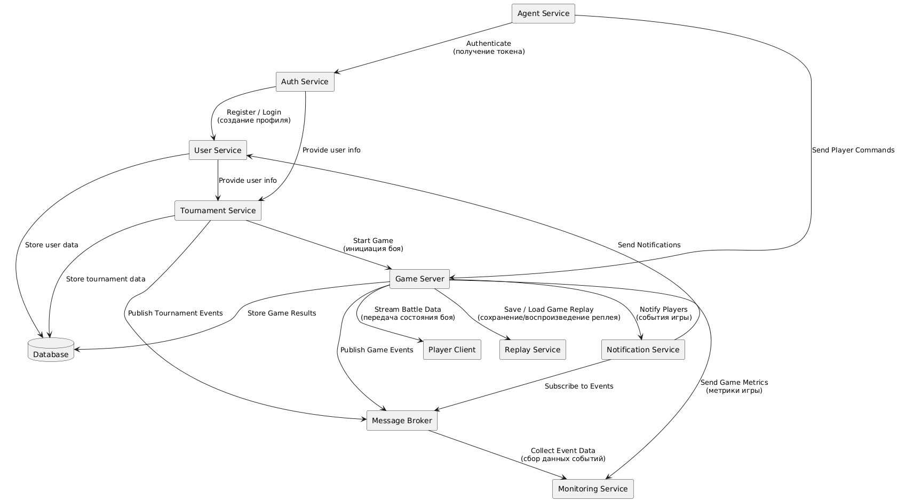

# Архитектура микросервисного приложения "Космический бой"

## 🎯 Цель

Разработка микросервисной архитектуры для игры **Космический бой**, с разделением на взаимодействующие сервисы, масштабируемостью и расширяемостью.

---

## 📦 Микросервисы и приложения

| Компонент           | Назначение                                                                 |
|---------------------|----------------------------------------------------------------------------|
| **Auth Service**     | Регистрация и аутентификация пользователей                                |
| **User Service**     | Управление пользователями и их рейтингами                                 |
| **Tournament Service** | Управление турнирами, заявками и результатами                            |
| **Game Server**      | Игровая логика: симуляция боев, обработка команд                          |
| **Agent Service**    | Запуск программ игроков и отправка команд в игру                          |
| **Notification Service** | Рассылка уведомлений (о турнирах, боях, приглашениях и т.д.)         |
| **Player Client**    | Отображение битвы в реальном времени                                      |
| **Message Broker**   | Асинхронное взаимодействие между сервисами (Kafka). Топики: `tournament.invites`, `game.events`, `user.notifications`. Включает механизм Dead Letter Queue для обработки ошибок доставки сообщений.               |
| **Database**         | Хранение пользователей, турниров, боёв и логов                            |
| **Replay Service**   | Сервис для хранения и воспроизведения боёв. |
| **Monitoring Service**   | Сервис для сбора метрик (Prometheus) и логов (ELK Stack) для мониторинга системы. |

---

## 🔄 Взаимодействие между компонентами

- `User Service → Tournament Service`: REST API — создание и участие в турнире
- `Auth Service → User Service`: REST API — создание и управление пользователями
- `Tournament Service → Game Server`: REST API — запуск игры
- `Agent Service → Game Server`: Kafka — отправка команд игрока
- `Game Server → Player Client`: WebSocket / SSE — трансляция битвы
- `Game Server → Notification Service`: Kafka — игровые события
- `Notification Service → User Service`: REST или Kafka — отправка уведомлений
- Все сервисы → БД: JDBC / ORM — запись и чтение данных

---

## 📡 Endpoints и взаимодействие микросервисов

### 🔐 Auth Service
| Метод | Endpoint        | Описание                         |
|-------|------------------|----------------------------------|
| POST  | /auth/register   | Регистрация нового пользователя |
| POST  | /auth/login      | Аутентификация пользователя     |
| GET   | /auth/me         | Получение текущего пользователя |

---

### 👤 User Service
| Метод | Endpoint                | Описание                                |
|-------|--------------------------|-----------------------------------------|
| GET   | /users/{id}              | Получение информации о пользователе     |
| PUT   | /users/{id}/rating       | Обновление рейтинга пользователя        |
| GET   | /users/{id}/history      | Получение истории боёв пользователя     |

---

### 🏆 Tournament Service
| Метод | Endpoint                    | Описание                            |
|-------|------------------------------|-------------------------------------|
| GET   | /tournaments                | Получение списка турниров           |
| GET   | /tournaments/{id}          | Получение информации о турнире      |
| POST  | /tournaments               | Создание нового турнира             |
| POST  | /tournaments/{id}/join     | Подать заявку на участие            |
| GET   | /tournaments/{id}/results  | Получение результатов турнира       |

---

### 🤖 Agent Service
| Метод | Endpoint             | Описание                                  |
|-------|-----------------------|-------------------------------------------|
| POST  | /agent/upload         | Загрузка программы управления             |
| POST  | /agent/send-command   | Отправка управляющей команды на сервер    |
| GET   | /agent/status         | Получение статуса агента                  |

---

### 🚀 Game Server
| Метод | Endpoint                 | Описание                                      |
|-------|---------------------------|-----------------------------------------------|
| POST  | /game/start               | Запуск новой игры                             |
| POST  | /game/command             | Приём команды игрока                          |
| GET   | /game/{id}/state          | Текущее состояние игры                        |
| GET   | /game/{id}/replay         | Получить реплей прошедшей игры                |
| POST  | /game/{id}/replay/save    | Сохранить реплей игры                         |

---

### 🔔 Notification Service
| Метод | Endpoint                      | Описание                                  |
|-------|--------------------------------|-------------------------------------------|
| POST  | /notifications/send           | Отправить уведомление пользователю        |
| POST  | /notifications/broadcast      | Массовая рассылка уведомлений             |
| GET   | /notifications/{userId}       | Получение списка уведомлений пользователя |

## ⚠️ Потенциальные узкие места и масштабирование

| Компонент           | Проблема                                       | Решение                              |
|---------------------|------------------------------------------------|--------------------------------------|
| Game Server         | Высокая нагрузка при множестве боев            | Масштабирование, распределённое состояние |
| Notification Service| Массовая отправка                              | Асинхронные очереди, параллельные воркеры |
| БД                  | Общая точка отказа                             | Разделение по сервисам, read replicas |
| Message Broker      | Потеря сообщений                               | Durable очереди, репликация, мониторинг, использование Dead Letter Queue |

---

## 🛠 Компоненты с частыми изменениями и OCP

| Компонент           | Часто меняется                                 | Применение принципа OCP              |
|---------------------|------------------------------------------------|--------------------------------------|
| Game Server         | Новые команды, оружие, механики                | Командный шаблон, strategy pattern   |
| Tournament Service  | Новые типы турниров, логика рейтинга           | Расширяемые модули турниров          |
| Notification Service| Новые каналы доставки                          | Интерфейсы и внедрение через DI      |
| Agent Service       | Новые языки программ и платформы               | Модули запуска, фабрика агентов       |

---

## 📝 Текстовое пояснение

Архитектура построена по микросервисному принципу: каждый сервис выполняет изолированную функцию и может быть развернут независимо. Это повышает гибкость, устойчивость к сбоям и упрощает развитие проекта.

Для взаимодействия используется как REST (синхронно), так и Kafka (асинхронно). Отдельный Message Broker позволяет отсоединить отправителя и получателя, избежать tight coupling.

Для безопасности взаимодействия между микросервисами используется аутентификация через **JWT** (JSON Web Tokens). Все сервисы взаимодействуют через защищённые каналы, используя токены для подтверждения авторизации пользователей. API Gateway обеспечит централизованный доступ и безопасность, выполняя маршрутизацию запросов и контроль доступа.

Вся логика игры реализуется на **Game Server**, который принимает команды от **Agent Service** и передаёт визуализацию на **Player Client**. Уведомления о событиях турниров и боёв обрабатываются в **Notification Service**.

Для мониторинга и анализа состояния системы используются **Prometheus** для сбора метрик и **ELK Stack** (Elasticsearch, Logstash, Kibana) для логирования. Эти сервисы обеспечивают мониторинг в реальном времени и помогают в быстрой диагностике проблем.

Приложение поддерживает принцип открытости/закрытости (OCP): основные компоненты расширяемы без изменения их основного кода.

---

## 📈 Диаграмма

---

